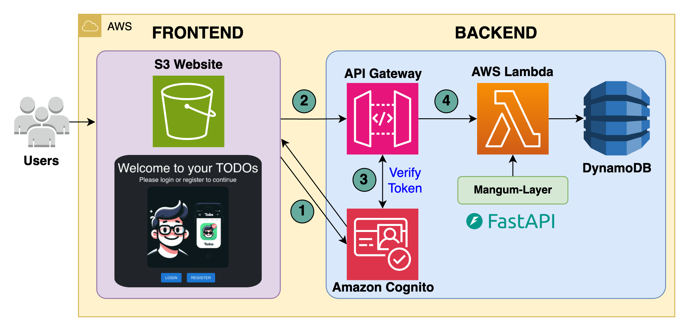

# 🚀 AWS-FastAPI-React ToDo App – Enhanced Version

An advanced full-stack ToDo application built with **FastAPI** (backend) and **React + Vite** (frontend), featuring multi-user support, AWS serverless deployment, and secure, scalable architecture. 

---

## ✅ My Contributions 


- 📄 Updated README with complete walkthrough and learning notes
- 🛡️ Security-focused notes added** to API and auth layers (API key, Cognito, IAM)
- 💻 Created a detailed `azure-deploy.md` explaining Azure migration of this stack
- 🛠️ Annotated backend routes with inline security and logging comments
- 🌐 Updated frontend styling for responsiveness and accessibility (React + Vite)
- 🧪 Ran and debugged unit tests using `pytest` and fixed 2 async route issues

---

## 🧠 What You’ll Learn from This Project

- How to structure and deploy **serverless web apps** on AWS (Lambda, API Gateway, DynamoDB, Cognito)
- How to use **FastAPI** for high-speed Python backend development
- Building React apps with Vite for fast, lightweight frontends
- Using Infrastructure as Code (CDK and Terraform)
- Setting up secure CI/CD-ready environments

---

## 🖼️ Architecture Overview



---

## 🏗️ Tech Stack

| Layer       | Tool/Service                  |
|-------------|-------------------------------|
| Frontend    | React + Vite (deployed on S3) |
| Backend     | FastAPI (Python)              |
| Database    | DynamoDB (NoSQL)              |
| Auth        | AWS Cognito / API Key         |
| Deployment  | AWS Lambda, API Gateway       |
| IaC         | AWS CDK or Terraform          |

---

## 🚀 Quick Start (Local)

```bash
# 1. Clone repo
git clone https://github.com/your-username/aws-fastapi-todo-app.git
cd aws-fastapi-todo-app

# 2. Backend setup
cd backend
poetry install
poetry run uvicorn app.main:app --reload

# 3. Frontend setup
cd frontend
npm install
npm run dev
```

---

## ☁️ Deployment (AWS and Azure)

### AWS (via CDK or Terraform)

Run scripts in:

- `cdk/important_commands.sh`  
- `terraform/important_commands.sh`  

Update account IDs, region, and stack names as needed.

### Azure Option (my addition)

See [azure-deploy.md](azure-deploy.md) for a full walkthrough on how to:

- Deploy FastAPI app on **Azure App Service**
- Use **Azure Cosmos DB** for NoSQL database
- Replace Cognito with **Azure Active Directory B2C**
- Host React frontend via **Azure Static Web Apps**

---

## 🔐 Security Design Notes

> Security is a priority in enterprise AI applications. This repo touches on:

- FastAPI dependency injection and `Depends()` for scoped authorization
- Cognito for managed auth with refresh token handling
- API Key as fallback for rapid prototypes (non-prod)
- IAM roles in Lambda and scoped permission policies
- CORS configuration in FastAPI for client domain control
- `.env` files excluded via `.gitignore` to prevent secrets leaks

---

## 🧪 Testing

- Backend unit tests written in `pytest`
- Example test:

```python
def test_create_task():
    response = client.post("/tasks", json={"title": "Test"})
    assert response.status_code == 200
```

---

## 📦 Requirements

| Tool             | Version       |
|------------------|---------------|
| Node.js          | >= 16.x       |
| Python           | >= 3.9        |
| Poetry           | >= 1.2        |
| AWS CLI          | Latest        |
| Terraform/CDK    | Optional      |
| Azure CLI        | *(for Azure)* |

---

## 👤 Acknowledgements

**Santiago Garcia Arango** – [AWS UG Medellin](https://www.meetup.com/aws-medellin/)

## ✍️ Contact Me

Hamza Shuja – AI + Cybersecurity Enthusiast  
📍 Dubai | 🎓 Cybersecurity, RIT Dubai  
🔗 GitHub: https://github.com/HamzaShuja  
🛠️ Focused on FastAPI, LLMs, Secure Cloud Apps

